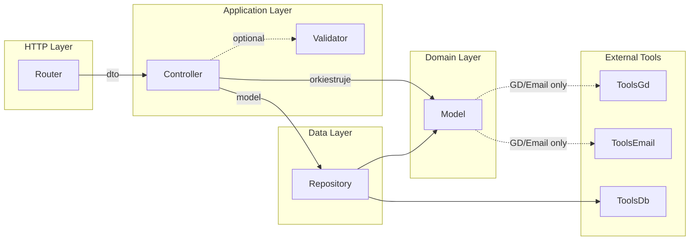

<!-- canonical: documentation/team/architecture/clean-architecture.md -->
<!-- sync: przy edycji ZAWSZE edytuj canonical, potem skopiuj tutaj -->

---
applyTo: '**/*.ts'
description: 'Clean Architecture guidelines - PRIORITY: CRITICAL | ENFORCE: STRICT | Version: 2.0'
---

# Wytyczne Architektoniczne - Clean Architecture

> 📖 **Więcej:** [Szczegółowy przewodnik](../../documentation/team/architecture/clean-architecture-details.md) | [AI Assistant](../../documentation/team/architecture/ai-decision-trees.md) | [Testowanie](../../documentation/team/architecture/testing-per-layer.md) | [Audyt Refaktoryzacji](../../documentation/team/architecture/refactoring-audit.md)

## 🎯 Filozofia

**Separation of Concerns** - kaĹĽda warstwa ma jedno, dobrze zdefiniowane zadanie.
System oparty na **Clean Architecture** z jednokierunkowym przepływem zależności.

## 🚨 ZASADY OBOWIĄZKOWE (MUST)

AI: Te reguły są **nie negocjowalne** - zawsze enforce przy generowaniu/review kodu:

1. ❌ Model **NIE MOŻE** importować Controller ani Repository
2. ❌ Model **NIE MOŻE** wykonywać operacji I/O do **bazy danych**
3. ❌ Repository **NIE MOŻE** zawierać logiki biznesowej
4. ❌ Router **NIE MOŻE** tworzyć instancji Model ani wywoływać Repository
5. ❌ Validator **NIE MOŻE** być wewnątrz Router, Controller, Repository ani Model
6. ✅ Validator **MUSI BYĆ** osobną klasą (jeśli potrzebny)
7. ✅ Przepływ **MUSI BYĆ**: Router → (Validator) → Controller → Repository → Model
8. ✅ Controller **MUSI** zarządzać transakcjami (nie Repository)

## 📐 Przepływ Danych (OBOWIĄZKOWY)

**ASCII (quick reference):**

```
Router → Controller.addFromDto(dto) → Controller.add(model) → Repository → Model
                                              ↓
                                         ToolsGd/ToolsEmail
```

**Mermaid (pełny diagram):**



**Zasada:** Żadna warstwa NIE może komunikować się z warstwą "wyżej".

**Validator:** Osobna, opcjonalna klasa do walidacji/transformacji danych.

-   Wywoływana przez Router (transformacja danych HTTP) lub Controller (przed utworzeniem Model)
-   **NIE** jest warstwą - jest narzędziem używanym przez Router/Controller
-   **MUSI** być osobną klasą (nie może być wewnątrz innych warstw)

## 🏛️ Warstwy Architektoniczne

### **Router (HTTP Layer)**

**Rola:** Najcieńsza warstwa - tłumaczy HTTP na wywołania aplikacji.

âś… **Powinien:**

-   Definiować endpointy (`app.post('/items', ...)`)
-   Wywołać **jedną** metodę Controllera (np. `Controller.addFromDto(dto)`)
-   Zwrócić odpowiedź HTTP (`res.send()`, `next(error)`)

❌ **NIE powinien:**

-   Zawierać logiki biznesowej
-   Tworzyć instancji Model (`new Item()`) - to robi Controller
-   Wywoływać Repository bezpośrednio
-   Wywoływać Validator bezpośrednio (deleguj do Controller)

**Wzorzec docelowy:**

```typescript
// âś… DOBRZE - Router przekazuje DTO do Controller
router.post('/items', async (req, res, next) => {
    try {
        const result = await ItemsController.addFromDto(req.parsedBody);
        res.send(result);
    } catch (error) {
        next(error);
    }
});

// ❌ LEGACY - Router tworzy Model (tolerowane w istniejącym kodzie)
router.post('/items', async (req, res, next) => {
    const item = new Item(req.parsedBody); // ❌ Nie kopiuj tego wzorca
    await ItemsController.add(item);
    res.send(item);
});
```

---

### **Validator (Validation Layer)**

**Rola:** Osobna klasa do walidacji danych wejściowych (HTTP/DTO).

**Kiedy Validator jest OBOWIÄ„ZKOWY:**

-   Encja z **polimorfizmem** (różne podklasy, np. Letter → OurLetter/IncomingLetter)
-   Encja ze **złożonym DTO** (>10 pól, zależności między polami)
-   Wymagana **walidacja kontekstowa** (sprawdzenie stanu innych obiektĂłw)

**Przykłady encji wymagających Validatora:** `Letters`, `Offers`, `Invoices`

âś… **Powinien:**

-   Być **osobną klasą** (np. `LetterValidator`, `InvoiceValidator`)
-   Walidować atrybuty wymagane do określenia typu obiektu
-   Dostarczać szczegółowe komunikaty błędów (diagnostyka)
-   Być **stateless** (tylko statyczne metody)
-   **Rzucać błędem** przy nieprawidłowych danych (fail-fast)
-   Używać **TypeResolver** dla logiki wyboru typu (patrz: Polimorfizm)

❌ **NIE powinien:**

-   Być **wewnątrz** Router, Controller, Repository ani Model
-   Zawierać logiki biznesowej (→ Model)
-   Wykonywać operacji I/O (baza danych, API)
-   **Naprawiać/transformować** niepełnych danych
-   Duplikować logiki wyboru typu (używaj TypeResolver)

**Lokalizacja:** Obok Model w warstwie domenowej (np. `src/letters/LetterValidator.ts`)

**Wywołanie:** Tylko przez **Controller** (w metodzie `addFromDto`/`editFromDto`)

**Filozofia:** Validator **wymusza kompletność danych** - jeśli klient przesłał niepełne dane, to błąd, nie workaround.

**Przykład:**

```typescript
// âś… DOBRZE - Validator jako osobna klasa
export default class LetterValidator {
    // Walidacja typu na podstawie danych z klienta
    // WAŻNE: Ta sama kolejność warunków co w LetterRepository.getLetterType()
    static validateLetterTypeData(initParam: any): ValidationResult {
        // 1. OurLetterContract (id == number && _project.id)
        if (initParam.isOur && initParam.id == initParam.number && initParam._project?.id) {
            return { isValid: true, expectedType: 'OurLetterContract' };
        }
        // 2. OurOldTypeLetter (id != number)
        if (initParam.isOur && initParam.id != initParam.number) {
            return { isValid: true, expectedType: 'OurOldTypeLetter' };
        }
        // 3. OurLetterOffer (isOur && _offer.id)
        if (initParam.isOur && initParam._offer?.id) {
            return { isValid: true, expectedType: 'OurLetterOffer' };
        }
        // 4. IncomingLetterContract (!isOur && _project.id)
        if (!initParam.isOur && initParam._project?.id) {
            return { isValid: true, expectedType: 'IncomingLetterContract' };
        }
        // 5. IncomingLetterOffer (!isOur && _offer.id)
        if (!initParam.isOur && initParam._offer?.id) {
            return { isValid: true, expectedType: 'IncomingLetterOffer' };
        }
        // Brak dopasowania - rzuć szczegółowy błąd
        return { isValid: false, errors: ['Missing _project.id or _offer.id'] };
    }

    // Walidacja spójności danych biznesowych
    static validateLetterData(letter: Letter): string[] { ... }
}

// Controller
const validation = LetterValidator.validateLetterTypeData(initParam);
if (!validation.isValid) {
    throw new Error(`Invalid letter data: ${validation.errors.join(', ')}`);
}
const letter = LettersController.createProperLetter(initParam);

// ❌ ŹLE - walidacja wewnątrz Model/Controller
class Letter {
    validate() { ... } // NIE - to Ĺ‚amie Single Responsibility
}
```

---

### **Controller (Application Layer)**

**Rola:** Orkiestruje operacje - koordynuje Repository i Model.

âś… **Powinien:**

-   Implementować use case (np. "dodaj nowe miasto")
-   Zarządzać transakcjami bazodanowymi
-   Wywoływać Repository do operacji CRUD
-   Wywoływać metody biznesowe na Model
-   Tworzyć instancje Model
-   Wywołać Validator przed utworzeniem instancji Model (jeśli Validator istnieje)

❌ **NIE powinien:**

-   Pisać zapytań SQL
-   Operować na `request`/`response`
-   Zawierać logiki biznesowej (→ Model)
-   Zawierać walidacji (→ Validator)

**Wzorzec:** Dziedziczy po `BaseController<T, R>` (Singleton + DI)

---

### **Repository (Data Access Layer)**

**Rola:** Jedyny punkt kontaktu z bazÄ… danych.

âś… **Powinien:**

-   Implementować CRUD (Create, Read, Update, Delete)
-   Budować i wykonywać zapytania SQL
-   Mapować dane DB → Model (`mapRowToModel()`)
-   Obsługiwać polimorfizm zapisu/odczytu

❌ **NIE powinien:**

-   Zawierać logiki biznesowej
-   Wiedzieć o Controller czy Router
-   Koordynować innych Repository

**Wzorzec:** Dziedziczy po `BaseRepository<T>` (unikanie duplikacji CRUD)

---

### **Model (Domain Layer)**

**Rola:** Serce aplikacji - obiekty biznesowe i ich zachowanie.

âś… **Powinien:**

-   Definiować właściwości obiektu
-   Zawierać **invarianty domenowe** (np. `validate(): boolean`)
-   Zawierać logikę biznesową (kalkulacje, generowanie numerów)
-   Otrzymywać dane przez parametry metod

**Walidacja w Model vs Validator:**

-   **Model.validate()** - invarianty wewnętrzne obiektu (np. "data końca ≥ data początku")
-   **Validator** - walidacja danych wejściowych HTTP/DTO (np. "czy przesłano wymagane pola")

❌ **NIE powinien:**

-   Importować Controller ani Repository
-   Wykonywać operacji I/O do **bazy danych**
-   Zawierać logiki HTTP
-   Pobierać OAuth token (musi otrzymać `auth` w parametrze)

**WyjÄ…tek I/O - GD/Email:**

Model **MOŻE** mieć operacje na Google Drive / Email, jeśli:

1. ✅ Controller **orkiestruje** wywołanie (decyduje KIEDY)
2. âś… Model otrzymuje `auth: OAuth2Client` jako **parametr** (nie pobiera sam)
3. âś… Model importuje tylko `ToolsGd`/`ToolsEmail` (nie Controllery!)

Zobacz [szczegóły](../../documentation/team/architecture/clean-architecture-details.md#model-io).

## 🔧 Wzorce Implementacyjne

### Validator Pattern

**Kiedy używać:** Encje z polimorfizmem, złożonym DTO lub walidacją kontekstową.

```typescript
export default class EntityValidator {
    // Walidacja typu/struktury danych wejściowych
    static validateEntityTypeData(dto: EntityDto): ValidationResult {
        const result = { isValid: false, errors: [], expectedType: null };

        // UĹĽyj TypeResolver dla logiki wyboru typu
        const typeFlags = this.extractTypeFlags(dto);
        const resolvedType = EntityTypeResolver.resolve(typeFlags);

        if (!resolvedType) {
            result.errors.push('Cannot determine entity type');
            return result;
        }

        result.isValid = true;
        result.expectedType = resolvedType;
        return result;
    }

    // Formatowanie błędów (diagnostyka)
    static formatValidationError(
        dto: any,
        validation: ValidationResult
    ): string {
        return `Validation failed: ${validation.errors.join(', ')}`;
    }
}
```

### TypeResolver Pattern (dla polimorfizmu)

**Cel:** Współdzielona logika wyboru typu między Validator i Repository.

```typescript
// src/letters/LetterTypeResolver.ts
export type LetterTypeFlags = {
    isOur: boolean;
    hasProject: boolean;
    hasOffer: boolean;
    idEqualsNumber: boolean;
};

export default class LetterTypeResolver {
    static resolve(flags: LetterTypeFlags): string | null {
        // Ta sama logika dla HTTP (Validator) i DB (Repository)
        if (flags.isOur && flags.idEqualsNumber && flags.hasProject)
            return 'OurLetterContract';
        if (flags.isOur && !flags.idEqualsNumber) return 'OurOldTypeLetter';
        if (flags.isOur && flags.hasOffer) return 'OurLetterOffer';
        if (!flags.isOur && flags.hasProject) return 'IncomingLetterContract';
        if (!flags.isOur && flags.hasOffer) return 'IncomingLetterOffer';
        return null;
    }
}
```

**Przykłady encji z Validatorem:** `Letters`, `Offers`, `Invoices`

---

## đź“‹ Standard Nazewnictwa CRUD

**ObowiÄ…zujÄ…cy standard** dla metod Controller:

```typescript
// âś… CRUD Methods Standard (docelowy)
static async find(params)           // READ - wyszukiwanie z warunkami
static async addFromDto(dto, auth?) // CREATE z DTO - Router wywołuje tę metodę
static async add(item, auth?)       // CREATE z Model - wewnętrzne/testy
static async editFromDto(dto, auth?)// UPDATE z DTO - Router wywołuje tę metodę
static async edit(item, auth?)      // UPDATE z Model - wewnętrzne/testy
static async delete(item, auth?)    // DELETE - usuwanie rekordu
```

**Wzorzec addFromDto:**

```typescript
static async addFromDto(dto: ItemDto, auth?: OAuth2Client): Promise<Item> {
    // 1. Walidacja (jeśli potrzebna)
    ItemValidator.validateItemTypeData(dto);

    // 2. Tworzenie instancji Model
    const item = new Item(dto);

    // 3. Delegacja do kanonicznej metody
    return await this.add(item, auth);
}
```

**Deprecated patterns** (do usunięcia w starym kodzie):

-   ❌ `addNew()` → użyj `addFromDto()` lub `add()`
-   ❌ `getList()`, `getMilestoneTypesList()` → użyj `find()`
-   ❌ `new Model(req.body)` w Router → użyj `Controller.addFromDto(dto)`

---

## 🔧 Wzorce Implementacyjne

### BaseRepository<T>

**Wzorzec:** Baza dla wszystkich Repository z metodami CRUD i budowaniem warunkĂłw SQL.

```typescript
abstract class BaseRepository<T> {
    async addInDb(item: T, conn?, isTransaction?): Promise<void>;
    async editInDb(item: T, conn?, isTransaction?, fields?): Promise<void>;
    async deleteFromDb(item: T): Promise<void>;
    abstract mapRowToModel(row: any): T;
    abstract find(conditions?): Promise<T[]>;
}
```

**Wzorzec budowania warunkĂłw SQL (`makeAndConditions`):**

```typescript
// âś… POPRAWNIE - array + join pattern
private makeAndConditions(searchParams: SearchParams): string {
    const whereClauses: string[] = [];

    if (searchParams.projectId)
        whereClauses.push(`Projects.OurId = '${searchParams.projectId}'`);
    if (searchParams.contractId)
        whereClauses.push(`Contracts.Id = ${searchParams.contractId}`);
    if (searchParams.ids?.length)
        whereClauses.push(`Items.Id IN (${searchParams.ids.join(',')})`);

    return whereClauses.length > 0 ? whereClauses.join(' AND ') : '1';
}

// ❌ ŹLE - inline warunki w find()
async find(params) {
    let sql = 'SELECT ... WHERE 1';
    if (params.id) sql += ` AND Id = ${params.id}`;  // NIE RĂ“B TAK!
}
```

### BaseController<T, R>

**Wzorzec:** Singleton z prywatnymi metodami instancyjnymi.

> ⚠️ **DEPRECATED:** Metody `instance.create()`, `instance.edit()`, `instance.delete()` są **@deprecated**.
> W nowym kodzie używaj bezpośrednio `instance.repository.addInDb()`, `instance.repository.editInDb()`, `instance.repository.deleteFromDb()`.
> Szczegóły: [refactoring-auth-pattern.md](../../documentation/team/architecture/auth-migration.md)

```typescript
abstract class BaseController<T, R extends BaseRepository<T>> {
    protected repository: R;

    // PRYWATNY Singleton - NIE eksponuj getInstance()!
    private static instance: MyController;
    private static getInstance(): MyController { ... }

    // @deprecated - uĹĽywaj instance.repository.*InDb() zamiast tych metod
    protected async create(item, conn?, isTransaction?): Promise<void>;
    protected async edit(item, conn?, isTransaction?, fields?): Promise<void>;
    protected async delete(item, conn?, isTransaction?): Promise<void>;
}
```

**ZASADA: Każdy Controller MUSI eksponować statyczne metody CRUD:**

```typescript
// âś… PROSTY PRZYPADEK (asocjacje, proste modele):
static async add(item: T, conn?, isTransaction?): Promise<T> {
    const instance = this.getInstance();
    await instance.repository.addInDb(item, conn, isTransaction);
    return item;
}

// ✅ ZŁOŻONY PRZYPADEK (z Google Drive, walidacją):
static async add(item: T, auth?: OAuth2Client): Promise<T> {
    return await this.withAuth(async (instance, authClient) => {
        await item.createFolder(authClient);
        await instance.repository.addInDb(item);
        return item;
    }, auth);
}
```

**UŻYCIE:**

```typescript
// ✅ POPRAWNIE - statyczne wywołanie:
await MyController.add(item, conn, true);

// ❌ BŁĘDNIE - NIE eksponuj getInstance():
await MyController.getInstance().create(item); // NIE RĂ“B TAK!
```

### ToolsGapi.gapiReguestHandler()

**Kiedy używać:** Do operacji wymagających autoryzacji Google API (Drive, Docs, Gmail).

```typescript
// âś… POPRAWNIE - funkcja async z OAuth2Client jako pierwszy parametr
await ToolsGapi.gapiReguestHandler(req, res, async (auth: OAuth2Client) => {
    await model.someGoogleApiMethod(auth);
});

// âś… POPRAWNIE - z dodatkowymi argumentami
await ToolsGapi.gapiReguestHandler(
    req,
    res,
    model.exportToPDF,
    [documentId, options],
    model
);

// ❌ ŹLE - funkcja bez 'async'
await ToolsGapi.gapiReguestHandler(req, res, (auth: OAuth2Client) => {
    // ❌ Brak async
    model.someMethod(auth);
});
```

**Zasady:**

-   Funkcja **MUSI** przyjmować `OAuth2Client` jako pierwszy parametr
-   Funkcja **MUSI** być `async` lub zwracać `Promise`
-   UĹĽywaj tylko w **Router** (nie w Controller/Repository/Model)

## đź“‹ Zasady Refaktoringu

1. **Oznacz @deprecated** - nie usuwaj od razu
2. **StwĂłrz nowÄ… implementacjÄ™** w odpowiedniej warstwie
3. **Migruj stopniowo** - Router → inne komponenty
4. **Przeprowadź audyt** - [szczegółowa checklist](../../documentation/team/architecture/refactoring-audit.md)
5. **Usuń deprecated** po weryfikacji (grep/search)

> 📋 **Audyt Refaktoryzacji:** Po każdej refaktoryzacji CRUD/Repository/Model użyj [przewodnika audytu](../../documentation/team/architecture/refactoring-audit.md) aby zweryfikować, że nie utracono funkcjonalności.

## âś… Checklist Przed Commitem

-   [ ] Przepływ: Router → (Validator) → Controller → Repository → Model
-   [ ] Model NIE importuje Controller/Repository
-   [ ] Repository NIE zawiera logiki biznesowej
-   [ ] Controller zarzÄ…dza transakcjami
-   [ ] Validator jest **osobną klasą** (jeśli istnieje)
-   [ ] Validator NIE jest wewnÄ…trz innych warstw
-   [ ] Brak cykli zależności (sprawdź: `madge`)

---

📚 **Więcej:** [Szczegółowy przewodnik z przykładami](../../documentation/team/architecture/clean-architecture-details.md)

