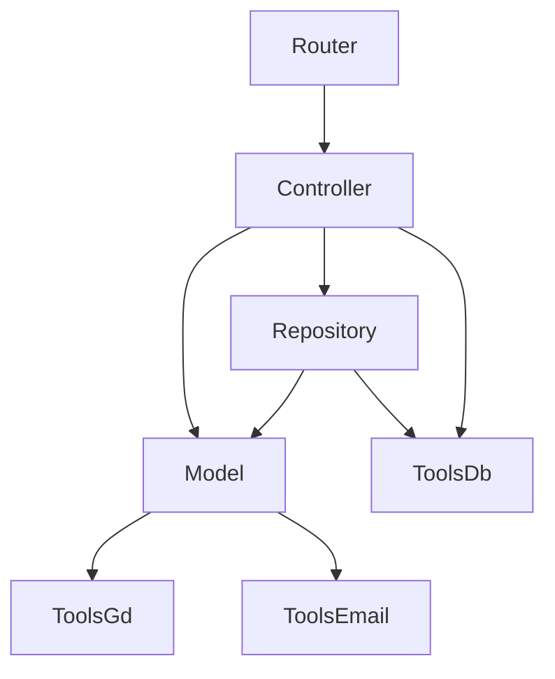

# Wytyczne Architektoniczne - Przewodnik Szczegółowy

> 🏛️ **Skrócona wersja:** [Podstawowe wytyczne](./architektura.instructions.md) | **🤖 Dla AI:** [AI Assistant](./architektura-ai-assistant.md) | **🧪 Testowanie:** [Testing Guide](./architektura-testowanie.md) | **📋 Audyt:** [Refactoring Audit](./architektura-refactoring-audit.md)

## Spis Treści

1. [BaseRepository - Implementacja](#1-baserepository)
2. [BaseController - Implementacja](#2-basecontroller)
3. [Transakcje Bazodanowe](#3-transakcje-bazodanowe)
4. [Model a Operacje I/O](#4-model-a-operacje-io)
5. [Strategia Deprecation](#5-strategia-deprecation)
6. [Przykłady Refaktoringu](#6-przykłady-refaktoringu)
7. [Unikanie Cykli Zależności](#7-unikanie-cykli-zależności)

---

## 1. BaseRepository

### Cel

Unikanie duplikacji kodu CRUD dla każdej encji poprzez wspólną klasę bazową.

### Implementacja

```typescript
// src/repositories/BaseRepository.ts
export abstract class BaseRepository<T extends BusinessObject> {
    protected tableName: string;

    constructor(tableName: string) {
        this.tableName = tableName;
    }

    /**
     * Dodaje obiekt do bazy danych
     * @param item - obiekt do dodania
     * @param externalConn - opcjonalne połączenie (dla transakcji)
     * @param isPartOfTransaction - czy część większej transakcji
     */
    async addInDb(
        item: T,
        externalConn?: mysql.PoolConnection,
        isPartOfTransaction?: boolean
    ): Promise<void> {
        if (isPartOfTransaction && externalConn) {
            return await ToolsDb.addInDb(this.tableName, item, externalConn);
        }
        return await ToolsDb.addInDb(this.tableName, item);
    }

    /**
     * Edytuje obiekt w bazie danych
     * @param item - obiekt do edycji
     * @param externalConn - opcjonalne połączenie (dla transakcji)
     * @param isPartOfTransaction - czy część większej transakcji
     * @param fieldsToUpdate - opcjonalna lista pól do aktualizacji
     */
    async editInDb(
        item: T,
        externalConn?: mysql.PoolConnection,
        isPartOfTransaction?: boolean,
        fieldsToUpdate?: string[]
    ): Promise<void> {
        if (isPartOfTransaction && externalConn) {
            return await ToolsDb.editInDb(
                this.tableName,
                item,
                fieldsToUpdate,
                externalConn
            );
        }
        return await ToolsDb.editInDb(this.tableName, item, fieldsToUpdate);
    }

    /**
     * Usuwa obiekt z bazy danych
     */
    async deleteFromDb(item: T): Promise<void> {
        const sql = `DELETE FROM ${this.tableName} WHERE Id = ?`;
        return await ToolsDb.executePreparedStmt(sql, [item.id], item);
    }

    /**
     * Mapuje wiersz z bazy danych na obiekt Model
     * MUSI być zaimplementowana w każdym konkretnym Repository
     */
    protected abstract mapRowToModel(row: any): T;

    /**
     * Wyszukuje obiekty w bazie danych
     * MUSI być zaimplementowana w każdym konkretnym Repository
     */
    abstract find(conditions?: any): Promise<T[]>;
}
```

### Przykład użycia

```typescript
// src/letters/LetterRepository.ts
export default class LetterRepository extends BaseRepository<Letter> {
    constructor() {
        super('Letters'); // Nazwa tabeli
    }

    // Implementacja wymaganej metody abstrakcyjnej
    protected mapRowToModel(row: any): Letter {
        // Polimorfizm - różne typy Letter
        if (row.IsOur && row.ProjectId) {
            return new OurLetterContract({
                id: row.Id,
                number: row.Number,
                description: row.Description,
                // ... pozostałe pola
            });
        }
        // ... inne typy
    }

    // Implementacja wyszukiwania
    async find(params: LetterSearchParams): Promise<Letter[]> {
        const sql = `
            SELECT * FROM Letters
            WHERE ProjectId = ? AND Status = ?
        `;
        const results = await ToolsDb.getQueryCallbackAsync(sql, [
            params.projectId,
            params.status,
        ]);
        return results.map((row) => this.mapRowToModel(row));
    }
}
```

**Korzyści:**

-   ✅ Kod CRUD napisany **raz** dla wszystkich encji
-   ✅ Spójna implementacja transakcji
-   ✅ Łatwe testowanie (mockowanie BaseRepository)
-   ✅ Polimorfizm w `mapRowToModel()`

---

## 2. BaseController

### Cel

Centralizacja dostępu do Repository, wzorzec Singleton, ułatwienie testowania.

### Implementacja

```typescript
// src/controllers/BaseController.ts
export abstract class BaseController<
    T extends BusinessObject,
    R extends BaseRepository<T>
> {
    protected repository: R;

    constructor(repository: R) {
        this.repository = repository;
    }
}
```

### Przykład użycia

```typescript
// src/letters/LettersController.ts
export default class LettersController extends BaseController<
    Letter,
    LetterRepository
> {
    private static instance: LettersController;

    constructor() {
        super(new LetterRepository()); // Wstrzykiwanie zależności
    }

    // Singleton pattern
    private static getInstance(): LettersController {
        if (!this.instance) {
            this.instance = new LettersController();
        }
        return this.instance;
    }

    // Publiczne metody statyczne używają getInstance()
    static async add(letter: Letter): Promise<Letter> {
        const instance = this.getInstance();
        return await ToolsDb.transaction(async (conn) => {
            await instance.repository.addInDb(letter, conn, true);
            // ... dodatkowa logika
            return letter;
        });
    }
}
```

**Korzyści:**

-   ✅ Dependency Injection (łatwe mockowanie w testach)
-   ✅ Singleton zapewnia jedną instancję Repository
-   ✅ Separacja odpowiedzialności (Controller ≠ Repository)

---

## 3. Transakcje Bazodanowe

### Zasada

**Controller zarządza transakcjami**, nie Repository ani Model.

### Dlaczego?

-   Controller widzi **pełny kontekst** operacji biznesowej
-   Repository nie musi wiedzieć o transakcjach
-   Łatwy rollback przy błędzie

### Implementacja

```typescript
// ✅ POPRAWNIE - Controller zarządza transakcją
class LettersController {
    static async add(letter: Letter): Promise<Letter> {
        return await ToolsDb.transaction(async (conn: mysql.PoolConnection) => {
            // 1. Dodaj główny rekord
            await this.repository.addInDb(letter, conn, true);

            // 2. Dodaj asocjacje (w TEJ SAMEJ transakcji)
            await this.addEntitiesAssociations(letter, conn);
            await this.addCaseAssociations(letter, conn);

            return letter;
        }); // Commit automatyczny lub rollback przy błędzie
    }

    private static async addEntitiesAssociations(
        letter: Letter,
        conn: mysql.PoolConnection
    ): Promise<void> {
        for (const entity of letter._entitiesMain) {
            const association = new LetterEntity({
                _letter: letter,
                _entity: entity,
                letterRole: 'MAIN',
            });
            await association.addInDb(conn, true); // Część transakcji
        }
    }
}
```

```typescript
// ❌ NIEPOPRAWNIE - Repository zarządza transakcją
class LetterRepository {
    async addWithAssociations(letter: Letter) {
        await ToolsDb.transaction(async (conn) => {
            await this.addInDb(letter, conn);
            // ❌ Repository nie powinien wiedzieć o asocjacjach!
        });
    }
}
```

**Wzorzec parametrów transakcji:**

```typescript
async someMethod(
    item: T,
    externalConn?: mysql.PoolConnection,      // Połączenie z zewnątrz
    isPartOfTransaction?: boolean              // Flaga transakcji
)
```

---

## 4. Model a Operacje I/O {#model-io}

### Zasada Ogólna

Model **NIE POWINIEN** wykonywać operacji I/O do **bazy danych**.

### Wyjątek: Operacje Zewnętrzne

Model **MOŻE** zawierać operacje na systemach zewnętrznych (Google Drive, Email), jeśli:

1. ✅ Controller **orkiestruje** wywołanie (decyduje KIEDY)
2. ✅ Model **enkapsuluje** szczegóły implementacji
3. ✅ Zachowana **spójność** z innymi metodami

### Przykład POPRAWNY

```typescript
// ✅ Model - operacje Google Drive
class OurLetter extends Letter {
    /**
     * Eksportuje dokument do PDF na Google Drive
     * PUBLIC: wywoływana przez LettersController.exportToPDF()
     */
    async exportToPDF(auth: OAuth2Client): Promise<void> {
        // Logika biznesowa - walidacja
        if (!this.gdDocumentId) {
            throw new Error('Cannot export: no GD document ID');
        }

        // Operacja zewnętrzna (nie DB!)
        await ToolsGd.exportDocToPdfAndUpload(auth, this.gdDocumentId);
    }

    /**
     * Tworzy plik dokumentu na Google Drive
     * PUBLIC: wywoływana przez LettersController.add() lub metody pomocnicze
     */
    async createLetterFile(auth: OAuth2Client): Promise<GdDocument> {
        const gdFile = this.makeLetterGdFileController(this._template);
        const document = await gdFile.create(auth);

        if (!document.documentId) {
            throw new Error('GD document not created');
        }

        this.gdDocumentId = document.documentId;
        return document;
    }
}

// ✅ Controller - orkiestruje operacje
class LettersController {
    static async exportToPDF(
        letter: OurLetter,
        auth: OAuth2Client
    ): Promise<void> {
        // Możliwe rozszerzenia:
        // - Sprawdzenie uprawnień użytkownika
        // - Logowanie operacji
        // - Dodanie LetterEvent (EXPORTED_TO_PDF)

        await letter.exportToPDF(auth);
    }
}

// ✅ Router - tylko wywołuje Controller
router.post('/export/:id', async (req, res) => {
    const letter = await LettersController.find([{ _id: req.params.id }]);
    await LettersController.exportToPDF(letter[0], auth);
    res.send({ success: true });
});
```

### Przykład NIEPOPRAWNY

```typescript
// ❌ Model - operacje bazodanowe
class Letter {
    async addInDb(): Promise<void> {
        // ❌ Model NIE POWINIEN komunikować się z bazą!
        await ToolsDb.addInDb('Letters', this);
    }
}

// ✅ POPRAWNIE - przez Controller → Repository
class LettersController {
    static async add(letter: Letter): Promise<void> {
        const instance = this.getInstance();
        await instance.repository.addInDb(letter);
    }
}
```

### Dlaczego ten wyjątek ma sens?

| Aspekt               | Operacje DB          | Operacje GD/Email               |
| -------------------- | -------------------- | ------------------------------- |
| **Abstrakcja**       | Repository (wzorzec) | ToolsGd/ToolsEmail (utility)    |
| **Testowanie**       | Mock Repository      | Mock ToolsGd                    |
| **Zmiana źródła**    | Łatwa (tylko repo)   | Nie dotyczy (zewnętrzny system) |
| **Logika biznesowa** | Brak w Model         | Walidacja w Model ✅            |
| **Orkiestracja**     | Controller ✅        | Controller ✅                   |

---

## 5. Strategia Deprecation

### Cel

Stopniowa migracja kodu bez łamania istniejącej funkcjonalności.

### Proces (4 kroki)

#### Krok 1: Oznacz @deprecated

````typescript
class Letter {
    /**
     * @deprecated Użyj LettersController.add(letter) zamiast tego.
     *
     * REFAKTORING: Logika przeniesiona do LettersController.add()
     * Model nie powinien wykonywać operacji I/O do bazy danych.
     *
     * Migracja:
     * ```typescript
     * // STARE:
     * await letter.addInDb();
     *
     * // NOWE:
     * await LettersController.add(letter);
     * ```
     */
    async addInDb(): Promise<void> {
        // Stara implementacja zachowana dla kompatybilności
        return await ToolsDb.transaction(async (conn) => {
            await super.addInDb(conn, true);
            // ...
        });
    }
}
````

#### Krok 2: Stwórz nową implementację

```typescript
class LettersController {
    /**
     * Dodaje nowy list do bazy danych
     * REFAKTORING: Logika przeniesiona z Letter.addInDb()
     */
    static async add(letter: Letter): Promise<Letter> {
        const instance = this.getInstance();
        return await ToolsDb.transaction(async (conn) => {
            await instance.repository.addInDb(letter, conn, true);
            await this.addEntitiesAssociations(letter, conn);
            await this.addCaseAssociations(letter, conn);
            return letter;
        });
    }
}
```

#### Krok 3: Migruj stopniowo

```typescript
// Router - PIERWSZY do migracji
router.post('/letters', async (req, res) => {
    const letter = LettersController.createProperLetter(req.body);

    // STARE (usuń):
    // await letter.addInDb();

    // NOWE:
    await LettersController.add(letter);

    res.send(letter);
});
```

#### Krok 4: Usuń deprecated

**Przed usunięciem sprawdź:**

```bash
# Wyszukaj wszystkie użycia
grep -r "\.addInDb()" src/

# Lub w PowerShell
Select-String -Path "src/**/*.ts" -Pattern "\.addInDb\(\)"
```

**Usuń tylko gdy:**

-   ✅ Żadne miejsce w kodzie nie używa deprecated metody
-   ✅ Nowa implementacja jest przetestowana
-   ✅ Zespół jest świadomy zmian

---

## 6. Przykłady Refaktoringu

### Przykład 1: addInDb → LettersController.add

**PRZED:**

```typescript
// Router
const letter = new OurLetterContract(req.body);
await letter.addInDb(); // ❌ Model komunikuje się z DB

// Model
class Letter {
    async addInDb() {
        await ToolsDb.transaction(async (conn) => {
            await super.addInDb(conn, true);
            await this.addEntitiesAssociationsInDb(conn);
        });
    }
}
```

**PO:**

```typescript
// Router
const letter = LettersController.createProperLetter(req.body);
await LettersController.add(letter); // ✅ Przez Controller

// Controller
class LettersController {
    static async add(letter: Letter): Promise<Letter> {
        return await ToolsDb.transaction(async (conn) => {
            await instance.repository.addInDb(letter, conn, true);
            await this.addEntitiesAssociations(letter, conn);
            return letter;
        });
    }
}

// Model (Letter.addInDb usunięty)
```

---

### Przykład 2: exportToPDF - delegacja z sensem

**PRZED (niepoprawne):**

```typescript
// Router
const letter = await findLetter(id);
await letter.exportToPDF(auth); // ❌ Router bezpośrednio do Model
```

**PO:**

```typescript
// Router
const letter = await LettersController.find([{ _id: id }]);
await LettersController.exportToPDF(letter[0], auth); // ✅ Przez Controller

// Controller - orkiestracja
class LettersController {
    static async exportToPDF(letter: OurLetter, auth: OAuth2Client) {
        // Punkt rozszerzenia: logowanie, uprawnienia, event
        await letter.exportToPDF(auth);
    }
}

// Model - enkapsulacja
class OurLetter {
    async exportToPDF(auth: OAuth2Client) {
        if (!this.gdDocumentId) throw new Error('No GD document');
        await ToolsGd.exportDocToPdfAndUpload(auth, this.gdDocumentId);
    }
}
```

**Dlaczego to nie jest "pusta delegacja":**

-   ✅ Controller zapewnia punkt rozszerzenia
-   ✅ Model enkapsuluje walidację (`gdDocumentId`)
-   ✅ Spójność z innymi metodami GD

---

### Przykład 3: Transakcje z wieloma asocjacjami

```typescript
class LettersController {
    static async add(letter: Letter): Promise<Letter> {
        return await ToolsDb.transaction(async (conn) => {
            // 1. Główny rekord
            await instance.repository.addInDb(letter, conn, true);

            // 2. Dla OurLetter: ustaw number = id
            if (letter instanceof OurLetter) {
                letter.number = letter.id;
            }

            // 3. Asocjacje - równolegle
            await Promise.all([
                this.addEntitiesAssociations(letter, conn),
                this.addCaseAssociations(letter, conn),
            ]);

            return letter;
        }); // Automatyczny commit lub rollback
    }

    private static async addEntitiesAssociations(
        letter: Letter,
        conn: mysql.PoolConnection
    ): Promise<void> {
        const associations: LetterEntity[] = [];

        // MAIN entities
        letter._entitiesMain.forEach((entity) => {
            associations.push(
                new LetterEntity({
                    letterRole: 'MAIN',
                    _letter: letter,
                    _entity: entity,
                })
            );
        });

        // CC entities
        letter._entitiesCc.forEach((entity) => {
            associations.push(
                new LetterEntity({
                    letterRole: 'CC',
                    _letter: letter,
                    _entity: entity,
                })
            );
        });

        // Zapis - sekwencyjnie lub równolegle
        for (const association of associations) {
            await association.addInDb(conn, true);
        }
    }
}
```

---

## 📚 Dodatkowe Zasoby

-   [Clean Architecture (Robert C. Martin)](https://blog.cleancoder.com/uncle-bob/2012/08/13/the-clean-architecture.html)
-   [SOLID Principles](https://en.wikipedia.org/wiki/SOLID)
-   [Dependency Injection w TypeScript](https://www.typescriptlang.org/docs/handbook/2/classes.html)

---

## 7. Unikanie Cykli Zależności

### Cel

Eliminacja cykli zależności (`madge --circular`) dla utrzymania jednokierunkowego przepływu.

### 🚨 Zakazane Importy (bez wyjątków w nowym kodzie)

```
❌ Model → Controller     (Model NIE może importować Controllera)
❌ Model → Repository     (Model NIE może importować Repository)
❌ Repository → Controller (Repository NIE może importować Controllera)
❌ Router → Repository    (Router NIE może bezpośrednio importować Repository)
```

### ✅ Dozwolone Kierunki Zależności



### Wzorce Rozwiązywania Cykli

#### 1. Wydzielenie typów do osobnych plików

**Problem:** `ModelA` importuje `ModelB` dla typu, `ModelB` importuje `ModelA`.

**Rozwiązanie:** Wynieś interfejsy/typy do `types/types.d.ts`:

```typescript
// ❌ ZŁE - cykl
// ModelA.ts
import ModelB from './ModelB'; // dla typu _modelB: ModelB

// ModelB.ts
import ModelA from './ModelA'; // dla typu _modelA: ModelA

// ✅ DOBRZE - brak cyklu
// types/types.d.ts
export interface ModelAData {
    id: number;
    name: string;
}
export interface ModelBData {
    id: number;
    _modelA: ModelAData;
}

// ModelA.ts
import { ModelBData } from '../types/types';
_modelB: ModelBData; // interfejs zamiast klasy

// ModelB.ts
import { ModelAData } from '../types/types';
_modelA: ModelAData; // interfejs zamiast klasy
```

#### 2. TypeResolver dla polimorfizmu

**Problem:** Validator i Repository mają zduplikowaną logikę wyboru typu.

**Rozwiązanie:** Wspólny `TypeResolver` bez zależności od DB/HTTP:

```typescript
// src/letters/LetterTypeResolver.ts
export type LetterTypeFlags = {
    isOur: boolean;
    hasProject: boolean;
    hasOffer: boolean;
    idEqualsNumber: boolean;
};

export default class LetterTypeResolver {
    static resolve(flags: LetterTypeFlags): string | null {
        if (flags.isOur && flags.idEqualsNumber && flags.hasProject)
            return 'OurLetterContract';
        if (flags.isOur && !flags.idEqualsNumber)
            return 'OurOldTypeLetter';
        // ... pozostałe warunki
        return null;
    }
}

// Validator używa:
const flags = { isOur: dto.isOur, hasProject: !!dto._project?.id, ... };
const type = LetterTypeResolver.resolve(flags);

// Repository używa:
const flags = { isOur: row.IsOur, hasProject: !!row.ProjectId, ... };
const type = LetterTypeResolver.resolve(flags);
```

#### 3. Dependency Injection przez parametry

**Problem:** Model musi wywołać coś, co wymaga Controllera.

**Rozwiązanie:** Przekaż funkcję jako parametr:

```typescript
// ❌ ZŁE - Model importuje Controller
class Milestone {
    async createCases() {
        const templates = await CaseTemplatesController.find(...);  // ❌ CYKL!
    }
}

// ✅ DOBRZE - Controller przekazuje funkcję
class Milestone {
    async createCases(
        templatesFetcher: () => Promise<CaseTemplate[]>
    ) {
        const templates = await templatesFetcher();  // ✅ Brak importu
    }
}

// Controller wywołuje:
await milestone.createCases(
    () => CaseTemplatesController.find(...)
);
```

#### 4. Dynamic Import (ostateczność - tylko legacy)

**Problem:** Nie da się inaczej rozbić cyklu w starym kodzie.

**Rozwiązanie tymczasowe:** `await import()` zamiast statycznego importu:

```typescript
// ❌ NIE używaj w nowym kodzie!
// Tylko jako plaster na legacy do stopniowej refaktoryzacji

async someMethod() {
    // Dynamic import nie tworzy statycznego cyklu
    const { default: OtherController } = await import('./OtherController');
    await OtherController.doSomething();
}
```

**⚠️ UWAGA:** Dynamic import to **obejście**, nie rozwiązanie. Przy najbliższej okazji refaktoruj na jeden z wcześniejszych wzorców.

### Weryfikacja

```bash
# Sprawdź cykle
yarn check:cycles
# lub
npx madge --circular --extensions ts src

# Oczekiwany wynik:
# ✓ No circular dependency found!
```

### Checklist przy nowym imporcie

Przed dodaniem `import X from './X'` sprawdź:

1. [ ] Czy `X` już importuje coś z mojego modułu? (grep/IDE)
2. [ ] Czy mogę użyć interfejsu zamiast klasy?
3. [ ] Czy import jest zgodny z dozwolonym kierunkiem?
4. [ ] Czy `yarn check:cycles` przechodzi?

---

⬅️ **Powrót:** [Podstawowe wytyczne](./architektura.instructions.md)
