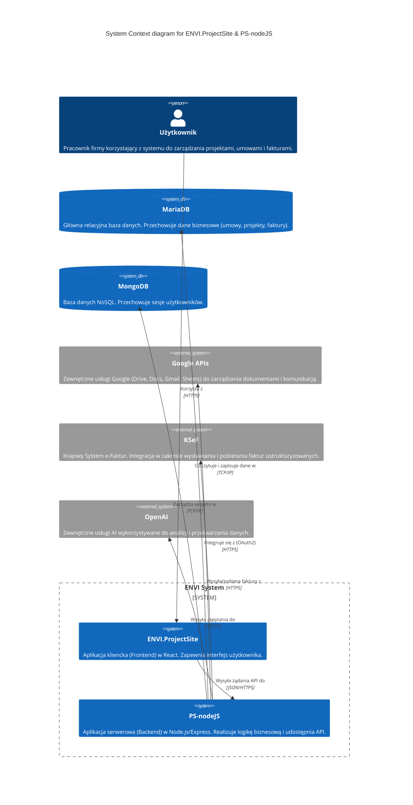

# System Context (C4)

Ten dokument przedstawia wysokopoziomowy diagram kontekstu systemu (C4 System Context) dla aplikacji ENVI.ProjectSite oraz jej backendu PS-nodeJS.

## Diagram Kontekstu

## Opis Elementów

- **ENVI.ProjectSite**: Frontendowa część systemu, z którą bezpośrednio wchodzi w interakcję użytkownik.
- **PS-nodeJS**: Serce systemu, realizujące architekturę Clean Architecture, odpowiedzialne za autoryzację, walidację i logikę biznesową.
- **MariaDB**: Główne źródło prawdy dla danych biznesowych.
- **MongoDB**: Wykorzystywane głównie do przechowywania sesji Express.
- **Google APIs**: Kluczowa integracja dla generowania dokumentów (Docs), przechowywania plików (Drive) oraz wysyłania powiadomień (Gmail).
- **KSeF**: Integracja z polskim systemem e-Faktur.
- **OpenAI**: Wsparcie procesów biznesowych poprzez sztuczną inteligencję.
