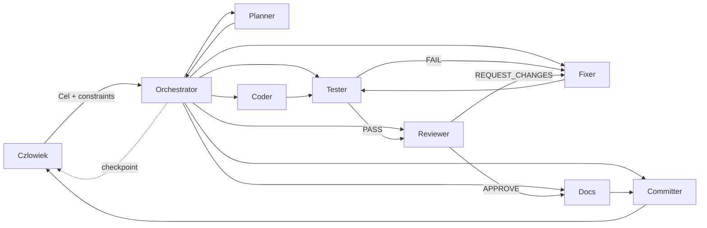
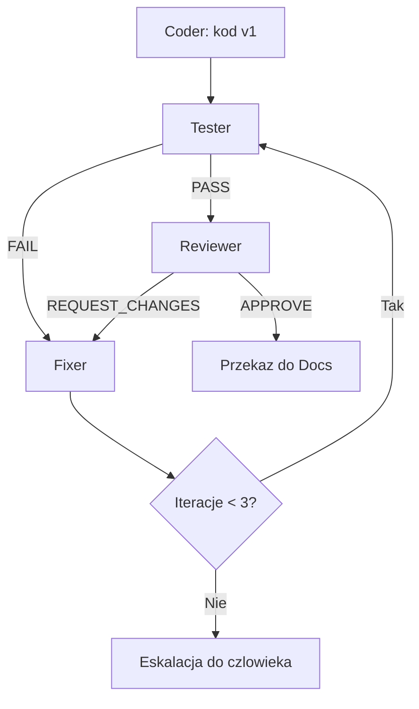
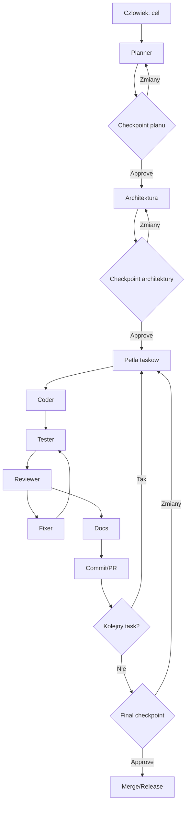
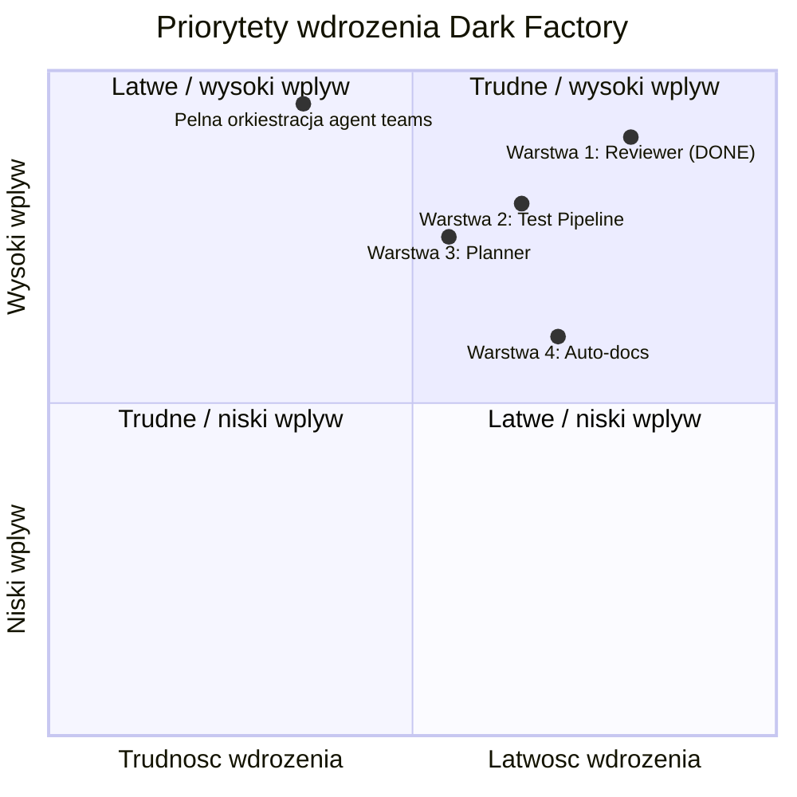

# Dark Factory Diagrams (Human-Friendly)

> Diagramy uzupelniajace `factory/CONCEPT.md`.
> Data aktualizacji: 2026-02-20

## 1. High-level architektura fabryki

Jak czytac:
- Czlowiek zatwierdza checkpointy.
- Orchestrator zarzadza przebiegiem.
- Subagenty realizuja wyspecjalizowane etapy.

## 2. Petla Coder/Reviewer/Fixer

Jak czytac:
- Loop ma limit 3 iteracji.
- Po limicie jest eskalacja do czlowieka.

## 3. Pelny proces z checkpointami czlowieka

Jak czytac:
- Checkpointy sa "hard gates".
- Produkcja taskow dzieje sie w petli.

## 4. Warstwy wdrozenia: wplyw vs latwosc

Jak czytac:
- Kolejnosc budowy preferuje szybki zwrot jakosci.
- Warstwa 1 jest juz zakonczona.

